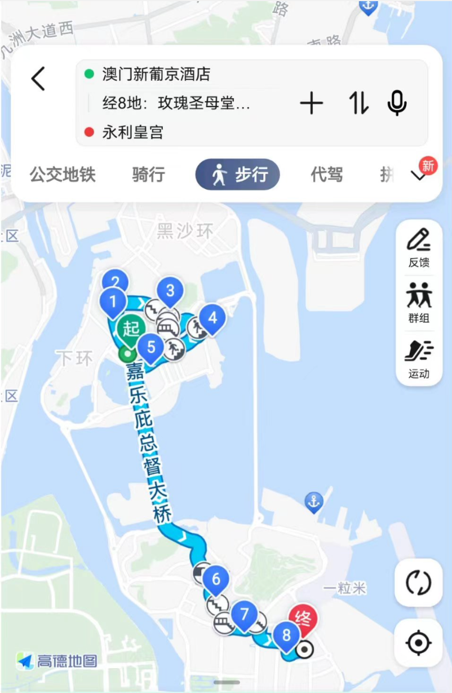

### 近期思考

---

#### 1. 跳出现状的束缚

工作中遇到的一个场景：需要实现某个需求

我的想法，在当前的运行机制中，增加逻辑A，尽可能保持当前运行机制不变

Leader的想法，找到合适的逻辑B，多花点时间把当前的运行机制调整成满足逻辑B的样子

为什么会有这样的不同？ 一个很大的可能，是我被细节套住了

1）熟悉系统的时候，我花了很多时间去理解当前系统的运行机制（保证增减逻辑的时候不会影响当前的逻辑），然后不知不觉就刻上了“思想钢印”，认为这就是系统合理运行的样子

2）leader更多的看功能大概要做什么，脑子里有对该功能的一些个人理解，在交换意见的时候，才发现和现状不一致

发现这个现象的时候，想想还有点可怕，不担心和leader意见不一致，而是我被局限住，完全没有产生思考其他可行方案的想法

#### 2. 被忽略的两端

进行技术评审，有一个字段存储的字符数量实际可能超出预期，同事让我留意一下。我最开始设计的时候考虑到了，也预留了存储，但结合业务来说，整个系统要处理这个量级的字符确实毫无意义，每次读写都是一种浪费

这突然让我想起正态分布的两端，大多数情况，我们直觉要处理的数据，在分布上基本处于正态分布的中间范围，但实际会存在一些分布处于边界两端的数据，特别的大，或者特别的小，超出直觉，所以常常被忽略

跳出技术的范畴，生活中很多符合正态分布的情况，其实也是如此

### 文章

---

#### 1. [互联网公司变平庸的原因：不够爱国](https://mp.weixin.qq.com/s/QGQKk5Sqnq3lBbZ1354oQw)

个人的一些小总结
- 通过软件复杂度，康威定律，推论大公司员工规模大，给互联网公司产品带来的许多负面影响
- 讲述不同公司的价值观，愿景，对不同用户群体利益博弈的影响
- 可持续发展的企业需要有社会责任，让大多数人都能获益
- 没有企业可以毫无道理的基业长青，要被社会和监管容忍需要有突出的社会贡献

#### 2. [入行 15 年，我还是觉得编程很难 ](https://mp.weixin.qq.com/s/B7Z0ROkiBqqxVKkLNR9BxQ)

文章提了8点，个人从中总结了一些有意思的

- 人能看懂的代码才是好代码
- 用创造的心态写代码
- 编程缺乏乐趣的原因——工程质量差，改一个bug，引入另一个bug
- 修改代码的理由，是人给的。不同的人关注的重点不一样，给出了修改理由也不一样
- 写单测，越早越好
- 编程最大的敌人是复杂度

### 教程

---

#### 1. [如何使用特定的SSH Key提交GIT](https://keysaim.github.io/post/git/2017-08-15-how-to-git-with-specific-ssh-key/)

在通过ssh协议进行git push的时候发现账户对不上，才知道原来ssh可以指定特定的key

### 工具

---

#### 1. VitePress

本博客就是基于这个框架搭建的,还有一些参考资，例如
- [官方文档](https://vitepress.dev/zh/)
- [从0到1的简要说明](https://juejin.cn/post/7239341970463391781)
- [其他vitepress资源（有很多美化的案例）](https://theme.sugarat.top/recommend.html)

#### 2. 高德地图途径点

周末去澳门，跟着小红书的路线，设计了一下路线：

> 拱北口岸➡️发财车➡️<新葡京>➡️议事亭、仁慈堂、<玫瑰圣母堂>➡️<天主教艺术博物馆与墓室、大三巴牌坊>➡️东望洋新街、东望洋灯塔➡️金莲花广场、渔人码头、<澳门回归贺礼陈列馆>➡️<永利澳门：发财树（12:00-22:00 整点)>➡️官也街➡️美狮美高梅➡️<威尼斯人、巴黎人、伦敦人>➡️<永利皇宫（音乐喷泉：19:20 茉莉花、20:00我心永恒、20:20 我和我的祖国、20:40 月光爱人）>➡️拱北口岸

然后突然发现，高德地图的导航增加途径点可以用上，于是得到了这个图：

会觉得其实也不是很好用，公交地铁路线就不能增加途径点，常用的只有步行和驾车支持这个功能。

为什么没有app提供这样的路线DIY的功能呢？如果有的话，对于旅行攻略爱好者来说，简直是梦中情app

### 书影

---

#### 1. 《杀死一只知更鸟》

这周终于把《杀死一只知更鸟》看完了，不少启发，下面这篇回答，比我能想到的写的还要好

[怎么评价《杀死一只知更鸟》? - 泡澡的鱼的回答 - 知乎](https://www.zhihu.com/question/279914409/answer/1121406676)

### 吐槽

---

#### 1.差点亏了300块

[科技爱好者周刊（第 292 期）：所有代码都是技术债 - 阮一峰的网络日志 (ruanyifeng.com)](https://www.ruanyifeng.com/blog/2024/03/weekly-issue-292.html) 里有个广告是HuluAI，号称

> **只要298元，就可以永久无限量使用**，免除逐一访问 GPT4 / 文心一言 / Midjourney / DALL-E 的麻烦，而且访问速度快。

看着有点心动，毕竟官方价格太贵了，300块永久用GPT-4，想想就超值，不过在剁手之前，去讨论AI比较多的即刻上搜索了下，只有一条动态，但还好看了下，不然就血亏了。这种GPT套壳应用，如果没有和官方结果比对，确实很难判断，是否真正去调了GPT4

