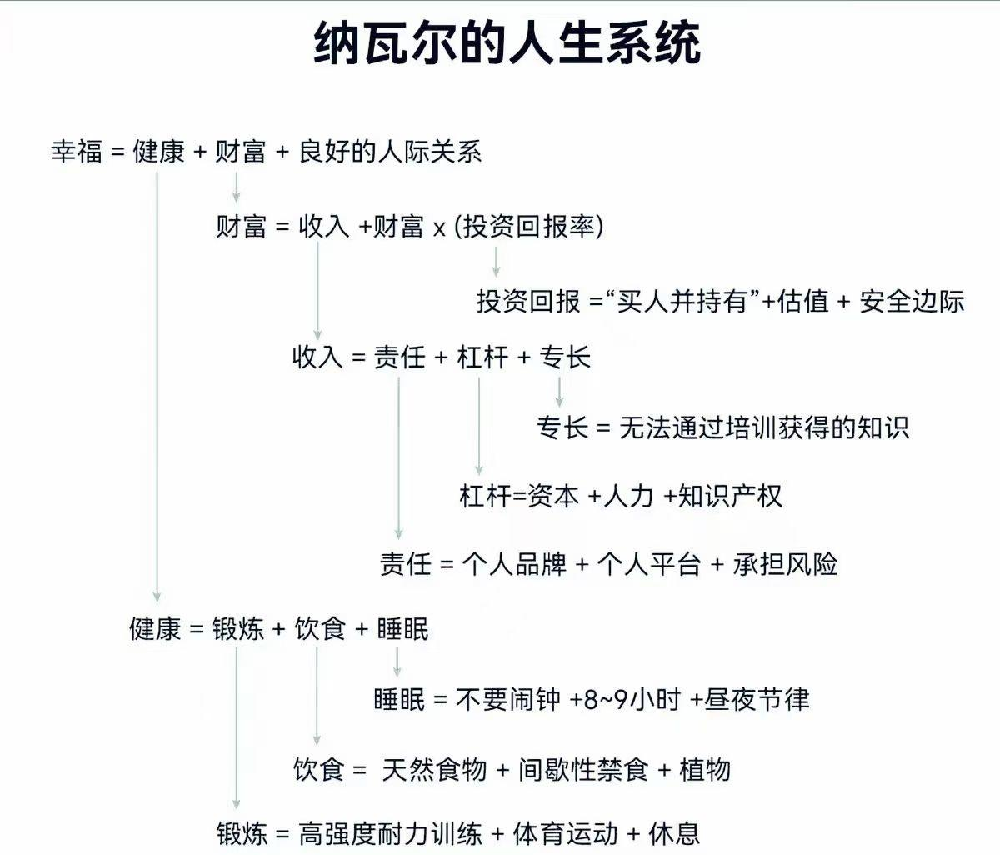

### 在思考

---

#### 1. 迟点给结论，也好过给一个错误的结论

最近工作上的事情

手头上正在处理一个工作任务，然后有业务咨询前段时间出现的一个问题A，之前在另一个群里有过类似问题B的讨论，看了下问题A出现的时间，基本一致，虽然这个问题A的错误信息不一样（只是有点接近），但不想过多的投入精力，直接用当时问题B的结论回复。

然后leader看到之后私下提了一下：这个问题A的错误信息好像得不出问题B的结论。然后我这才仔细看了下， 确实无关，只是时间惊人的一致，但不是同一个问题，好在后来业务也没有继续追问了。

回过头来想想，我确实有点着急下结论了，原因在于手头有个工作要交付，不想付出太多的时间，但其实，**迟点给结论，也好过给出一个完全错误的结论**，如果是一个重大问题，像这样着急下结论反而会让人质疑我的专业能力。

再反思日常的工作习惯，我总是急于快速响应别人的问题，哪怕当前掌握的信息不全面，就像日常聊天一样，断断续续的不断更新结论。而leader的沟通很明显的一点，就是在掌握信息思考清楚之后，再清楚完整的整段回复

这是值得学习的地方。原以为只是心态的问题，但其实是沟通习惯的问题

#### 2. 前端资源的public目录 

在给这个数字花园，上传pdf(像图片引用那样引用pdf文件)，本地能访问但是部署到github pages却各种404找不到文件。

最开始以为是中文名之类的问题，但是改了之后也不行，最后在vitepress的官方文档上，找到了这个说明：

> 常见的图像，媒体和字体文件会被自动检测并视作资源。
>
> 通过链接引用的文件不会视作资源
>
> 在 Markdown 内，通过链接引用的 PDF 或者其他文档不会被自动视作资源。要使这些文件可用，你必须手动将其放在项目的 [`public`](https://vitepress.dev/zh/guide/asset-handling#the-public-directory) 目录内。

最后直接放到了public文件，终于可以在网页上访问了

但好奇的是，为什么pdf这么特殊，不被当作资源，可能关键词搜索的不对，目前也还没搜到答案，一些猜测

- 反向思考，特殊的不是pdf，而是图片
- 正常资源都应该放在public目录下，原封不动的部署到服务器上
- 图片因为过于常见，被特殊处理成了资源

### 在看

---

#### 1. [纳瓦尔的人生系统](https://m.okjike.com/originalPosts/65fb6c2237f7165b216a3910?s=eyJ1IjoiNTg4NjNiODNlMjVmMzgwMDE1NmFiYTdiIiwiZCI6MX0%3D)

类似的文字之前看到过纯文字，这个看到图片版感觉视觉上更舒服

#### 2. [中国“巴菲特”段永平的人生故事【万字长文】 ](https://mp.weixin.qq.com/s/yxPSZYXTDsxwK0jCnMXvhQ)

文章介绍了段永平的人生轨迹

- 童年到大学，是一个性格比较开朗、也被磨炼的很有毅力、能主动给自己设立目标，全力实现的这么一个人
- 大学毕业到他当上厂长期间的这六年，算是段永平在社会上的摸索期，段永平更加了解自己，不适合体制内，喜欢市场经济，也不太看重研究生学历、北京户口、未来分到的房子、比较明朗，步步高升的职业发展，做职业选择也敢于走差异化的路线，选择人才密度少的公司，做自己喜欢的游戏行业
- 从他28岁到40岁，这是他展现自己的商业才能最重要的12年。这12年，他建立起当时中国一流的企业，成功推行了自己对企业的理解，也培养很多，现在在各领域发光发热的企业家，这些人后来也是他一辈子的朋友
- 现在专注投资及家庭生活

还介绍了他的人生理念、对商业的理解、投资的框架

### 在练习

---

#### 1. [椭圆机指南：正确的使用与常见错误](http://xhslink.com/mbHRbF)

膝盖不适，据说椭圆机对膝盖比较友好，开始用椭圆机进行有氧锻炼，这篇小红书指南，简单讲了椭圆机的正确姿势

- **脚后跟**发力，踩实带动椭圆机，而不是用脚尖。 
- 身体笔直
- 膝盖弯曲不能内八也不能外八

印象深刻的是：健身房里看到的人基本都是用脚尖发力，脚后跟会离开踏板

#### 2. 《快乐进行曲》四手联弹

谱子:  [欢乐进行曲(四手联弹).pdf](/pdf/欢乐进行曲(四手联弹).pdf) 

钢琴教室的小型音乐会圆满结束，四手联弹《快乐进行曲》

终于又可以开始练新曲子了

### 在尝试

---

#### 1. 柠檬除水垢

电热水壶都积满了水垢，而且锈都在水里，完全不能喝。下意识觉得要买点醋，但是总觉得一大瓶醋只是用来清洗水垢有点浪费，查了下小红书，可以用柠檬

切了几片柠檬，和水一起加热到沸腾，泡一会儿之后真的水垢都没了，柠檬真YYDS

#### 2.  联通漫游费返还

看了账单发现前阵子去香港，明明没有开通漫游，但还是扣了漫游费，气的是，明明没有享受到网络服务，但是却扣费了。并且近三个月去香港，都有对应的扣费，直接客服反馈。

原本以为需要扯大半天，想不到客服电话简单的问了几个问题就同意退费了，这倒是没想到，还很贴心的提醒说：这个退费是以赠款的形式退回的，可以抵扣月租，但是我的账户里有低消，最后还是会扣足低消，建议等欠费之后再反馈，然后联通这边再调整

这舒服的服务体验倒是完全没有想到
