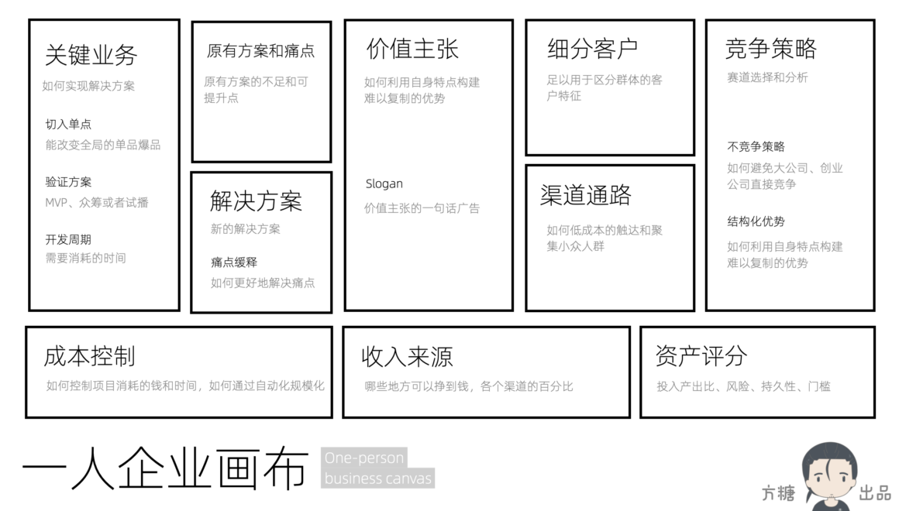
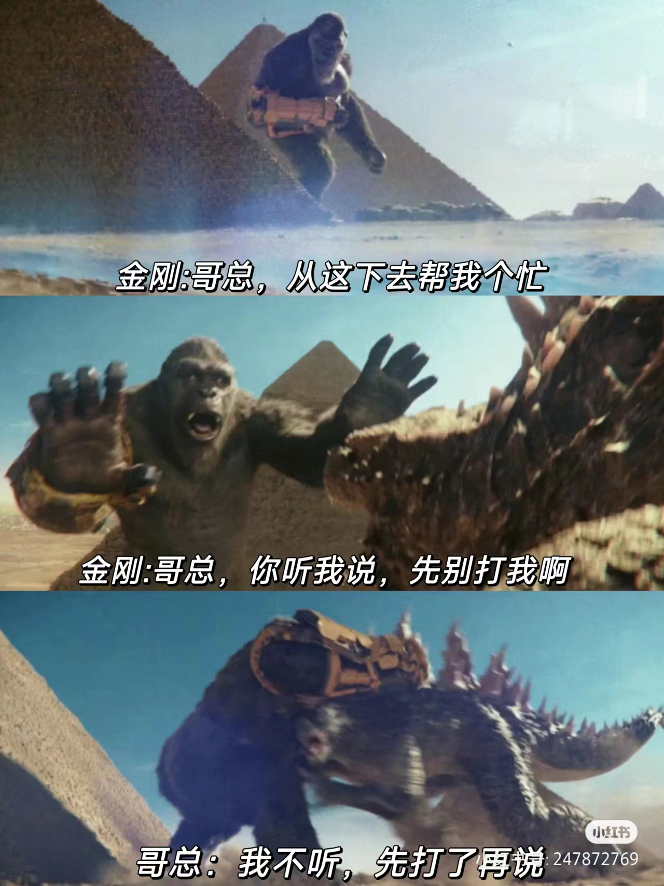

### 在思考

---

#### 1. 不妨抱着试试看的心态

万事开头难，很多事情当我一想到需要付出的精力和成本，或者看不到成果，再加上执行力差，就会想着算了吧

但这一阵子玩《金铲铲之战》的时候，想到一个阵容，就会想要去试试看，这样的组合会有什么效果，然后支撑着我玩了一把又一把...

就是这种试试看的心态，让我光速启动游戏，这也给我一个启发：

当想做某件事但执行力不够的时候，不妨抱着试试看的心态

#### 2. 技术管理：质量-成本-效率

团队老板开了个team会，传达公司高层的一些信息，然后透露了一个事情，关于技术管理

据说观点来自于研发中心的老板，如何做好技术管理，实际上就是处理好质量-成本-效率三个事情

看到这三个词儿的第一印象，想到了各种不可能三角，质量要高，成本要低，效率又高，乍一看是一个不可能三角的状态

于是冒出来一个想法：管理要做的事情，是不是可以理解为调和各种不可能三角呢？

#### 3. 发传单与举牌

上班路上总是会遇到各种传单，这次的是健身房

第一反应，这家新开的健身房，找人派传单的目的，只是想让别人知道这里开了一家健身房，不然大早上大家都赶着上班，怎么可能会停下来了解健身房细节呢

但是传单，要触达客户，需要客户接过传单并且查看，如果只是为了让别人知道自己的存在，直接楼下举牌不是更明显吗，再配上一个二维码？直接视觉上劫持路过的人的注意力。可能制作广告板子的费用更贵吧

### 在看

---

#### 1. [《一人企业方法论》第二版，也适合做其他副业（比如自媒体、电商、数字商品）的非技术人群](https://github.com/easychen/one-person-businesses-methodology-v2.0)

关于一人企业方法论的分享，在 “存活个体 -> 一般个体 -> 超级个体 ”的阶段中，作者还处于一般个体的阶段。

不过对于还在纯领工资，连“存活个体”都算不上的我，依然有不少参考价值，其中个人觉得最有价值的，是这个[一人企业画布](https://ft07.com/opb-canvas-and-opb-report/)思考工具

比较系统全面的罗列了一人企业需要考虑的东西有哪些，并且教程中，还辅以《从零构建软件产品和服务》的案例参考，对于新手来说上来就开发拥有许多功能的软件产品和服务成本还是过高了，但总体的流程思路是非常值得借鉴的

#### 2. [恐怖的竞业协议：互联网大厂在“吃人”](https://b23.tv/Wy2ymPi)

这种竞业协议的滥用，感觉对普通劳动者太不友好了。

想起来之前跳槽到我们公司的同事，居然没有被竞业，也属实幸运。估计也有成本方面的考量，10个人里面随便竞业一个，就能对其他所有人产生震慑力了

#### 3. 电影《哥斯拉大战金刚2:帝国崛起》

看完最大感受：肢体语言不仅可以跨国界，还能跨物种

#### 4. [梳理一下昨晚播客圈「旺仔珂珂糖」（末日狂花主理人）翻车这事儿的来龙去脉。2.0](https://mp.weixin.qq.com/s/7iKIe7tpFLQhkBrCo5rq8w?utm_source=wechat_session)

即刻上多了一些关于播客的讨论，不听播客很久了（不习惯长时间安静下来啥也不做只听播客），但翻车的大V之前关注过，只是后面发现发的内容没有价值就直接取关了。想不到居然翻车了，因为偷偷抢注其他顶流播客的商标，是不太道德，但感觉翻车的核心，是给自己封了很多名过其实的title，像极了权游里的龙妈。

让我这种完全不会包装自己履历的老实人大开眼界 ，突然想起来之前看到的[《如何往脸上贴金》](https://m.okjike.com/originalPosts/65dddc13de5f287348861f33?s=eyJ1IjoiNTg4NjNiODNlMjVmMzgwMDE1NmFiYTdiIiwiZCI6MX0%3D)，不得不服是有点套路在的

#### 5. [CBDB | 可视化历史名人的关系和足迹](https://mp.weixin.qq.com/s/evUacKtLOVCrZahgRmnjsg)

在科技爱好者周刊里面看到了这个库，想法不错，可惜的是填了几个感兴趣的历史人物名字，例如嬴政等都没有检索到相关的信息，稍微有点局限于数据库。不过看到这个工具，倒是有了一些想法

- 公开数据集，其实都可以当作一种生产资料，是可以转化为产品的
- 如今AI发展如火如荼，未来会不会这种制图工作，都可以交由AI来完成？

#### 6. [【睡前消息】以色列空袭伊朗驻叙利亚大使馆，伊朗为何战略保守迟迟不还手?](https://www.bilibili.com/video/BV1kz421y7Xg/?share_source=copy_web&vd_source=7fea3d1133489af62f3e3a849586ec16)

马督工从伊朗军备的角度分析了下，提到了现在各国具备很多都是冷战遗产，要研发购买新型装备成本都太高了

看到这突然就想起[注意力报告004](attention_004.md)讲到的冷战后倒卖军火的军火商，这种角色的存在确实足以左右现代格局了

### 在逛

---

#### 1. 文明丽迹-北魏平城与云冈石窟艺术

[文明丽迹-北魏平城与云冈石窟艺术.pdf](/pdf/文明丽迹-北魏平城与云冈石窟艺术.pdf)

几点感想：

- 石头工艺似乎最容易保存，其他的都容易氧化又或者破碎
- 北朝曾经出现的大规模毁佛行动，以及后面修石窟，都和思想统治有关。毁佛是因为当时掌权者想让大家相信道教，后面的皇帝礼佛是因为佛教的观念有助于思想统治，甚至后面会出现的两个佛的形象，也是当时掌权的太后（皇帝才五岁）让自己掌权合理化的一种手段

#### 2. [蝶光星河](http://xhslink.com/zDbKqG)

一个关于孤独症的公益艺术展，现场视觉效果很惊艳，值得一看。就是排队的人数比想象中要多

之前看财新的报道[显影｜孤独症孩子长大后 组成没有服务的“社区家庭”是否可能](https://weekly.caixin.com/red/2024-03-08/102173222.html?s=6d1d82d074b45ff005e9df373fedec9f8f2653692ee60093bfd1407cd5a3d56e411779b1330ba53c&originReferrer=Androidshare)了解到这个群体，困境在于，没有一个特别好的民营机构给他们做服务，成本收益不对等，但家长们又不能置之不理，其中一种方式，则是联合起来，共同出资，公司化运营给孤独症的孩子提供服务，是一个思路，感觉没有政府扶持也很难持续的感觉

