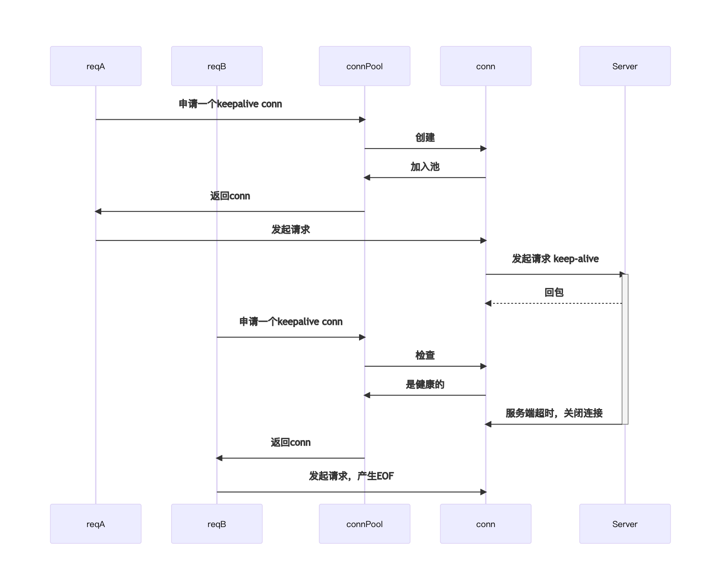
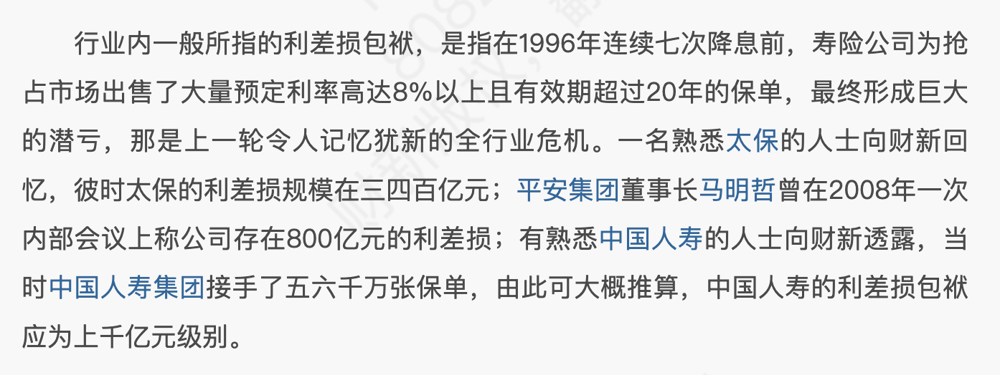
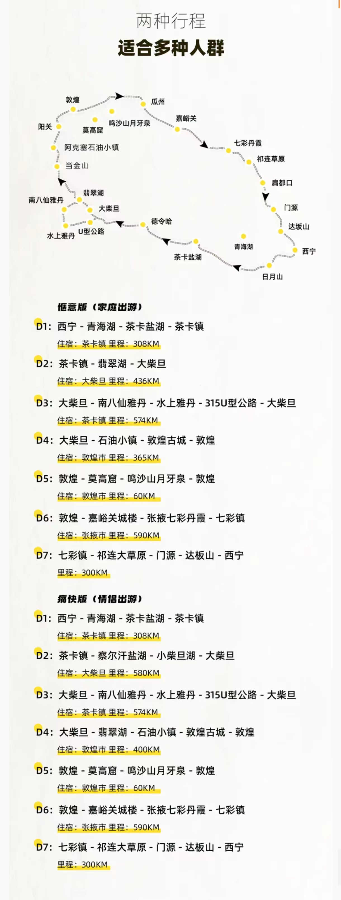

### 在思考

---

#### 1. 为什么没有中间商聚合官方羊毛合集

最近买机票在付钱的时候，用支付宝付款偶然发现用农行信用卡提示可以优惠30块，省到就是赚到，反正也经常用农行

然后就在想，为什么没有一个中间商平台聚合支付、购物等各家官方优惠信息呢？优惠本身就是为了获客，让更多人知道不是更好吗？

纯属个人猜想

- 聚合太多的优惠，各家条件不一，琳瑯满目，容易看花眼。
  - 条件多。大部分要求新客、新用户等等，像这次农行信用卡用了就优惠没有门槛的属于可遇不可求了
  - 聚合下来也需要不同的分类规则，繁琐且复杂
- 优惠具备时效性，有可能刚收集下来，没几天就已经失效了，这时候还得维护

但目前觉得，要是真能做起来，商家在平台上架优惠，用户在平台发现优惠，商家能获客，用户能省钱，平台也能赚点商家的广告费，看着也挺合理的

#### 2. 数据加工的批处理 VS 流处理

业务需求，需要统计加工数据，然后生成报表（场景抽象了一下，实际不是报表场景）

比较简单能想到的实现方式，就是批处理，也就是定时任务定时启动扫描原始数据进行统计与计算，得到目标结果

- 这种方式，如果是只有一个数据源驱动结果的话，其实简单又能完成需求
- 但如果是有多个数据源都能驱动结果，也就是A数据源没有，但是B数据源有数据的情况下，也要生成报表。这就意味着扫描A，产生结果之后，还要扫描B更新结果，最后报表的统计依赖于所有相关定时任务是否能够完成。这样的风险在于，如果一个定时任务跑批处理出现异常没有按照预期执行完成，则会严重影响另一个定时任务的结果。（当然其实重跑能解决问题，但是批处理基本意味着数据量大，效率其实很低

对于这种需求，还有另外一个流处理的方式，就是原始数据生成的时候，直接发消息，消息队列消费的时候直接根据这条消息产生计算结果，最终只需要定时任务扫描计算结果即可

### 在看

---

#### 1. [easychen/lean-side-bussiness: 精益副业：程序员如何优雅地做副业 (github.com)](https://github.com/easychen/lean-side-bussiness)

接着上周的《一人企业方法论》，这周把这个《精益副业》的在线文档看完了，文档还提供了一套独立开发和网课的案例组合，应该也是作者在这条路径走下来的一些经验。整个文档的核心理念，依然是

- 利用工作/在做的事情积累副产品，并朝着成为资产的方向发展

这刚好也是这个「注意力周报」的理念之一，这个「注意力周报」也只是我日常生活顺手打造的副产品而已，当然目前也不觉得这就是一份资产（还没能带来收入），但也是我目前比较宝贵的数字资料了

#### 2. [摆拍，编剧本，网红上热搜，短视频是怎样恶心全国的？【围炉夜话】-哔哩哔哩](https://b23.tv/qWsEppi)

视频里，作者表达了对网红猫一杯翻车事件的观点以及对短视频的看法，个人摘录如下

- 介绍了传播学的概念——「黄色新闻」来源于美国报业用标题党、假新闻的方式吸引流量。其中缅因号的爆炸新闻甚至激发民间情绪，还引发了美国和西班牙之间的战争
- 网红和MCN为了起号，通过骂某家公司吸引流量，都不是商业竞争，就是纯粹的为了涨粉，污染商业环境
- 短视频段子大多都是假的，生活本身就平淡，哪里有那么多的巧合，大多是有目的性的

然后引申出了《幻象》这本书

> 当图像革命发生后，世界上就充斥着越来越多的伪事件。所谓伪事件，就是人工合成的新鲜事
>
> 为什么会出现这种情况呢？首先是观众不行
>
> 作者认为，自打第一份报纸发行后，采集新闻成了一种职业。但观众往往对这个世界有着过度的期望
>
> 可对于记者来说，真实的社会根本没有那么多有趣的事件
>
> 从前的人会抱怨，今天的世界太无趣。现在的人会抱怨，今天的报纸太无趣
>
> 于是采集新闻变成了制造新闻

有点意思，也很真实，突然就想起来以前twitter啥的大力整治假新闻的举措，如今在AI工具的加持，感觉后面假新闻只会越演越烈

另外《幻想》还提到了另外一个现象

> 名人渐渐取代了英雄。直到很晚近的年代，名人还几乎等价于伟人
>
> 一个人一定是在某方面取得了伟大的成就，要么有着伟大的权力，要么有着伟大的财富，要么有着伟大的德行，要么有着伟大的邪恶
>
> 才会获得名声，这是一种缓慢且自然的方式。而图像革命后，名声变成了可以打造的东西
>
> 英雄靠功绩扬名，名人靠形象扬名。英雄创造自己，名人由媒体创造。英雄是大写的人，名人是大写的人名，但英雄的孕育起码需要一个世代
>
> 往后每一代人都可能从英雄身上发现新的美德，英雄的面容和身材不需要刀削般清晰的线条。人身也不需要注脚，甚至不需要留下任何的照片
>
> 时间流逝使得他的英雄气概有增无减。
>
> 而名人永远是当代人，他们成于公共宣传，也毁于公共宣传。新闻让他生，也可以让他死，不是通过谋杀，而是通过窒息和饥饿。时间的流逝可以成就英雄，却会毁灭名人。因为没有谁比上一代名人更加彻底的被人遗忘

我日常长视频和短视频都会看，但更欣赏的依然是能给我带来思考的长视频。看短视频确实情绪上来了，但很快又下去了，到头来没觉得有太多营养，但如果就是想吸收点奶头乐，短视频确实是一个挺好的工具

#### 3. [你在京东搜过 BOOX，接着在朋友圈看到广告，然后你说，是微信输入法的锅？](https://mp.weixin.qq.com/s/-9b8CvodBltoB7FGx7lRHA)

科普了下**行为定向广告**在当前广告行业的应用（其实和输入法无关）

#### 4. [记一次http/1.1协议带来的EOF问题(golang)](https://segmentfault.com/a/1190000044321460)

工作中遇到了一个EOF的报错，找到这篇文章，很清晰的时序图，讲述了EOF问题产生的原因

##### 5. [封面报道｜处置问题险企_财新周刊频道_财新网 (caixin.com)](https://weekly.caixin.com/2024-03-15/102175684.html?p0#page2)

最开始对低利率的理解，只是我存到银行的钱的利息变少了，所以这是一种促进消费的宏观调控手段

但金融系统层面，保险投资等领域，都有极大的利差损，明明什么事情都没做错，但是却因为利率下行出现了资本的包袱

### 在做

---

#### 1. 五一西北大环线7天旅行研究心得

最近在看五一去哪里玩，从西安看到南京再到大西北环线，终于找到一个人流少，而且既有自然风光也有人文特色的地方了

人流量少的景点具备什么特征呢？

- 旅游淡季

- 交通不方便，大西北很大，而且很荒凉，景点与景点之间隔的特别的远。于是出行的选择要么自驾要么包车，有老有小的家庭大多不会选择地方，经不起折腾
- 热门景点，如莫高窟的门票，提前一个月放票，现在都过了两个星期了，余票还很充足，完全不用抢，说明这段时间也是淡季

因为交通不便而且环线一圈开车要2600km以上，开车也挺累的，我们两个人就选择那些2-8人小团，小红书上有一堆的攻略和广告帖子，基本路线都差不多的，毕竟大西北就那些地方能玩。最后找了一个团，之前朋友参加过也推荐了一个团，进行对比。此处不说团，只记录我是如何判断跟团的价格是否合理的

- 一般团的价格组成，车费+住宿+门票+餐饮（大西北的团基本都不包餐了）。
  - 其中门票是官方渠道票的话，大多没有操作空间
  - 车费如何判断呢？小红书上找了一下自驾游的花费帖子，看一下他们的油费+高速费+过路费等等，这些都是硬支出，也是没有操作空间的。
  - 那么剩下的最主要的费用成本，就是司机和酒店了
  - 粗略算了下跟团的总报价和小红书自驾的总费用差，主要是司机和酒店的差异了。这么一算价格倒也合理

- 两个团的报价差不多，都是有旅行社资格的，上天眼查之类的网站查也还行，那么这个报价就应该属于平均水平了，小红书上特别的多低价团，其实成本经过这么一算，淡季7天，人均4500左右的跟团价格（车+住宿+门票）是合理的，更低的就不知道怎么赚钱了，总不能赔本吧

最后会发现大部分团行程路线没有太大的区别，都是热门线路

### 在用

---

#### 1. [Jetbrains插件｜awesome-console](https://plugins.jetbrains.com/plugin/7677-awesome-console)

组里同事分享了一个插件，蛮好用，可以将console与ide里的文件link起来，实现点击console里的文本就能跳转到对应的文件

对于我的使用场景，则是解决git冲突的时候

- 之前总是用git status 列出有冲突的文件名，然后从左侧目录树逐层点开文件夹找文件
- 现在可以直接在console里点击打开冲突文件

#### 2. [沉浸式翻译 - 双语对照网页翻译插件 | PDF翻译 | 视频字幕翻译 (immersivetranslate.com)](https://immersivetranslate.com/)

最近在找免费英文资讯，想起了HackerNews，以前点进来看总会因为HackerNews全是英文有点劝退，但是这次打开忽然发现英文全部都自动翻译了。检查了下是之前就安装的沉浸式翻译的默认设置，只是一直没有用起来。效果确实蛮好，比起一个个单词看意思，还不如一个段落一个段落的学习，有充足的上下文翻译也更加准确

### 在现场

---

#### 1. [《开心麻花｜疯狂理发店》](https://m.damai.cn/damai/detail/item.html?utm=&itemId=765874787860&from=appshare)

第一次看沉浸式剧场，感觉喜剧效果确实超出我的期待，太好笑了，观众们也太细心了吧。这里沉浸式的定义是，剧情的走向由观众驱动，根据观众的实时反馈来决定后续的剧情

对于这类演出，基本以观众互动前后作为分割，感觉互动前的剧情，有点乱，人物多，事件多，而且演绎的时候还有点浮夸，稍显无聊的。

还好坚持到了观众互动，这时候就不得不服剧组的各种前期准备了，现场观众的提问和刁难居然都能接上，而且很多临场反应都能制作出很多笑点，真的太惊喜了

开心麻花在国内喜剧上真的YYDS，而且这一场还是明星场（梁田），中场休息好多人去要合照（虽然我并不知道她是谁 

