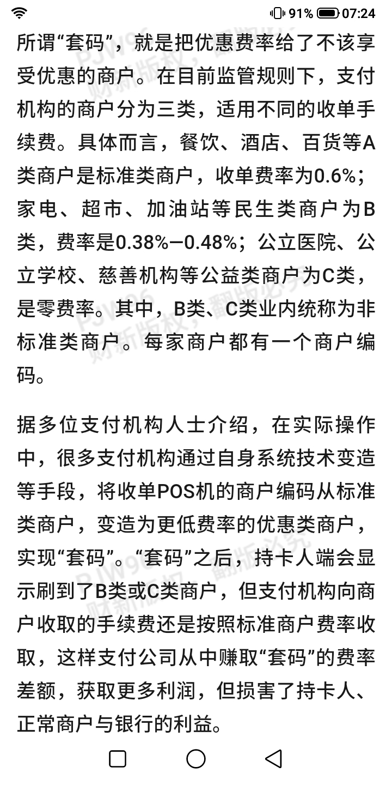
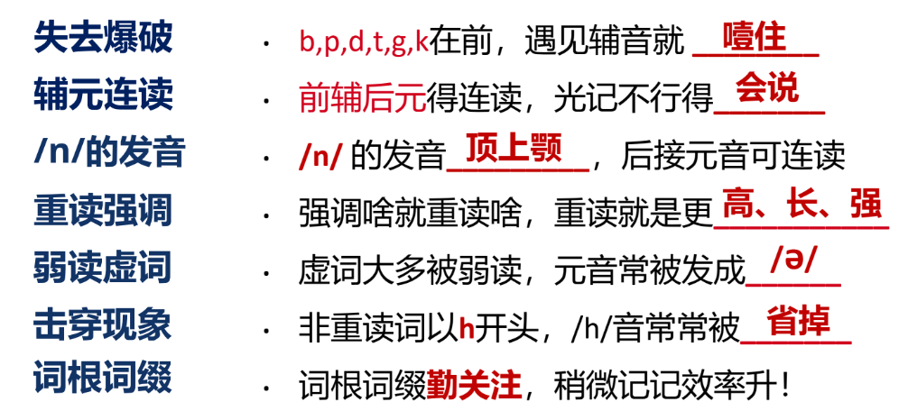

### 在做

---

#### 1. 注意力周报的素材积累

在前面的周报中，基本采用“微信和自己聊天”+typora的方式进行素材的收集和整理，实行了几周有些地方觉得有些不爽：

- 需要公司电脑和家里电脑切换登录，有时已经在手机上发送的消息在PC同步的时候会丢失，需要重新发送一遍
- 微信文本，无法二次编辑。只能在typora整理的过程中进行扩展和二次编辑

然后又再次恢复使用flomo，作为素材收集工具，最重要的是可以打标签进行素材的管理，例如一条素材如果已经用在了这个注意力周报，就可以打上一个「Used/数字花园/注意力周报」的标签，并且可以把不包含这个标签的内容给过滤出来，这样根据时间标签过滤，就可以知道还有哪些内容需要整理了

#### 2. [显示器养眼模式初探](https://mp.weixin.qq.com/s/EOgNuzFOibJb-JzwOWrSSg)

在启发之下，参考官方手册：[在 Mac 上更改显示颜色以更轻松查看屏幕内容 - 官方 Apple 支持 (中国)](https://support.apple.com/zh-cn/guide/mac-help/mchl11ddd4b3/mac)，打开了灰色滤镜，并且设置了快捷方式，可以从菜单栏中点击设置

黑白的成像确实有看墨水屏的感觉。然后再把typora的主题设置成Night，视觉上是蛮舒服的，感觉少了很多强光的刺激，紧跟其后，把flomo也设置成了暗色

感觉一个个App设置太麻烦了，然后直接把手机和mac的外观都设置成深色模式，瞬间觉得真香，一直以来都用浅色，改成深色的第一体验是，视觉上没那么刺眼了

好奇深色模式的来历，然后找到了[「深色模式」的前世今生，都在这一篇里了](https://www.uisdc.com/dark-mode-history)

稍微用了一段时间灰度滤镜之后，觉得有些元素和元素之间没法很好的区分开，估计是习惯了通过色差来辨别元素的视觉经验，现在只用深色主题，也挺香了

#### 3. 华为手机拍照技巧

五一要出去玩，平时只会傻瓜式拍照，这次看下别人是怎么用华为拍照的

整理了下，记在了这个数字花园的生活指南里[华为手机拍摄技巧](../../guide/photo/device_huawei.md)

### 在思考

---

#### 1. 关于信息流的价值沉淀

最近刷即刻比较多，这种社交媒体基本都是信息流的形式，发帖人通过帖子发起一个话题，然后吸引大家的评论转发。

总觉得信息流这种呈现形式不是一个好的形式，因为有意义的话题讨论中，总会有价值的内容出现，但却会被时间流逝所冲刷掉，这些讨论之所以会被遗忘，可能和人性有关：我们都贪新鲜，看动态往往只看**新**动态，看过之后下次再打开，只会从新的起点开始刷，可是随着时间的流逝，潜在的优质评论就被忽略掉了

而且时间久远的帖子，感觉就永远尘封了，没有活跃度，没有评论，感觉大多数信息流产品，都缺乏一个盘活的机制

其中发帖人，定期挖坟引用，倒是一个不错的办法

### 在看

---

#### 1. 一些关于华为的素材

最近在看的两份材料，都和华为有关

- [财新周刊｜理想汽车突围_财新周刊频道_财新网 (caixin.com)](https://weekly.caixin.com/2024-03-16/102175998.html?p0#page2)

  - > 李想号召管理层集体向华为学习，每个人至少阅读十本有关华为的书。理想汽车管理层普遍对华为赞誉有加。李想曾公开称，理想汽车对华为没有抱怨，只有学习和尊重，他为能够遇到华为这样的对手而感到幸运和兴奋。
    >
    > 李想并没有止步，2024年2月18日，他又宣称：“产品学苹果、制造学丰田、商业学特斯拉、组织学华为、变革学微软。”

- [分享个最近很触动的事儿：节前，华为的Mate60和芯片各种刷 - 即刻App (okjike.com)](https://m.okjike.com/originalPosts/6527a710aa7d4f2b3018bdf8?s=eyJ1IjoiNTg4NjNiODNlMjVmMzgwMDE1NmFiYTdiIiwiZCI6MX0%3D)
  - 正职有问题，副职一起落马，确保内部利益一致，不能让一个人因为另外一个人的问题而获益
  - 制度的落地需要所有相关人（特别是一线）的支持，如果因为利益受损而不支持新的制度，需要给予利益受损者合理的补偿

华为一入局新能源汽车赛道，就把蔚小理给“打残”了，这样的成绩，感觉和华为的组织制度有很大的关系，只是缺乏了员工视角，不知道作为被管理的员工，是不是真的得到过补偿，是不是发自内心的支持，之前只听说华为的加班是非常狼性的。别的不懂评价，起码目前的观感是，华为是懂利益分配的

作为消费者，我还是非常尊敬华为的，手机手表耳机啥的都是华为的产品，而且在体验了朋友刚买的问界之后，觉得百万豪车都不如智驾版的问界

#### 2. [安小竹: 突然想分享下公开表达对我的意义，以及一些个人心路历程和踩的坑](https://web.okjike.com/originalPost/6624a157362466632415dec4)

一个即刻用户对于公开表达的分享

前半段作为I人真的感同身受，暴露在公众视野中的感觉非常不适。对于我来说，一方面想有点影响力，另一方面又没克服这种不适，还处于动力<阻力的阶段

而作者正是从学做推广出发，分享自己觉得有用的东西，得到点反馈，逐步积累到现在，估计也免疫了吧，都开始分享长文思考了。果然要对“被关注”这件事情免疫，还是得多多分享，习惯周遭的目光才行

另外倒是提醒了版权这件事情，虽然自己也没啥好内容值得被抄袭的

#### 3.[写日记是我为数不多，坚持了多年的习惯。](https://m.okjike.com/originalPosts/661f9ce5de5f2873485a0c14?s=eyJ1IjoiNTg4NjNiODNlMjVmMzgwMDE1NmFiYTdiIiwiZCI6MX0%3D)

即刻用户分享的在日记中引入符号的记录方式

> 😄 胜利记录
> 😭 负面情绪记录
>
> ! 想法或灵感
> \+ 值得记录的事件或心情
> \> 需要安排的下一步行动
> ? 内心的疑问
> \- 值得关注的资讯
>
> 这些符号都会放在句子的开头，作为明确的标记.

有些符号和markdown的特殊符号冲突了，如果想用还得改一下，不过这个emoji来写日记，确实比文字更能传达情绪的变化

#### 4. [做自媒体，从最小阻力开始](https://m.okjike.com/originalPosts/662768093b9c66cae46ee986?s=eyJ1IjoiNTg4NjNiODNlMjVmMzgwMDE1NmFiYTdiIiwiZCI6MX0%3D)

即刻用户分享的，如何开始做自媒体的一些方法

当收集的素材足够多，这种排比的句式整理看起来强而有力，而且可以发散很多内容

#### 5. [You Are What You Read, Even If You Don’t Always Remember It - Jim Nielsen’s Blog (jim-nielsen.com)](https://blog.jim-nielsen.com/2024/you-are-what-you-read/)

>  I cannot remember the books I've read any more than the meals I have eaten; even so, they have made me. 
> 我不记得我读过的书，也不记得我吃过的饭菜;即便如此，他们还是造就了我
>
> Ralph Waldo Emerson(拉尔夫·沃尔多·爱默生)

看了很多书都记不住，为什么还要看。这是爱默生的答案

#### 6. 国内支付机构的套码获利

当一样东西，有两种不同的价格，也就存在着套利的空间

### 在体验

---

#### 1. 英语口语练习培训

参加了公司组织的英语口语练习培训，一些体验

- 为什么美/英式英语听力对国人有困难，但是中式英语却能听懂。主要还是外国人为了更快的把句子说完，习惯进行省略、连读，弱读，而我们国人的高考英语大多追求语法、单词咬字清楚。等到我们像外国人一样说英语，就能听懂了
  

- 可以刻意练习，反复听一个句子，分析自己听不懂的原因是什么，单词不懂补单词，语法不懂补语法，发音不懂研究发音习惯
