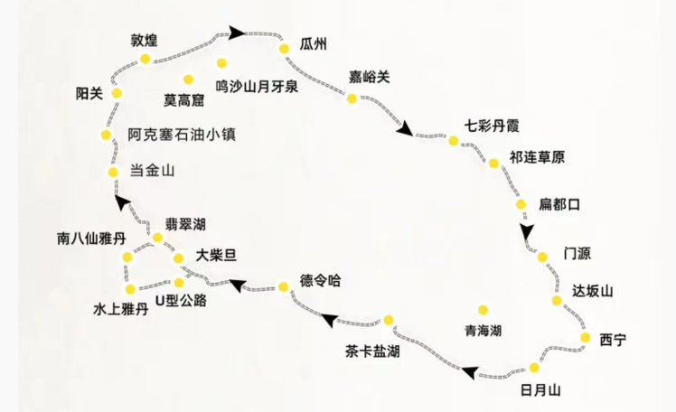
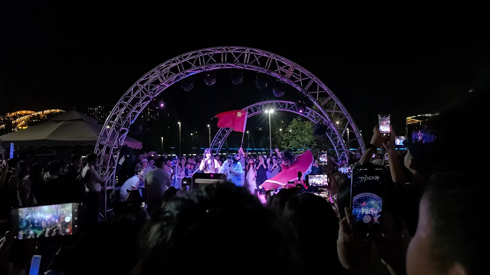

五一假期并且额外休假5天，去了一趟西北青甘大环线爽玩十天4.28-5.7，这两周主要都在休闲放松，没太关注别的，在此简单记录一下这趟西北游记吧

正常来说经典的青甘大环线只需要7+1天（需要提前一天到），从深圳直飞西宁机票太贵了，来回需要3k多，而从珠海飞兰州来回1500搞定，这个差价让我们毫不犹豫选择在兰州中转，没去过兰州还能顺带去转转。兰州-西宁高铁车次多也比较快，就是从深圳到珠海相对麻烦一些，考虑到机票完全可以接受。总共人均8100+，包含机票、报团、门票、吃喝、纪念品等，不买纪念品的情况下，其实只需要7k+，淡季出行还是蛮划算的，而且还没有人从众

行程如下：

Day1：深圳➡️珠海➡️兰州

Day2：兰州中山桥、黄河边➡️西宁野生动物园

Day3（大环线开始）：日月山➡️青海湖➡️茶卡盐湖天空一号景区

Day4：察尔汗盐湖（本来还有一个小柴旦湖，在察尔汗盐湖玩太久了，就没有去）

Day5：东台吉乃尔盐湖➡️水上雅丹➡️南八仙雅丹。 （路过在车上看了一眼小柴旦湖，湖看多了，都不想下车看了）

Day6：315U型公路➡️翡翠湖➡️石油小镇➡️鸣沙山，沙漠派对蹦野迪

Day7：莫高窟➡️《又见敦煌》➡️鸣沙山月牙泉➡️沙洲夜市

Day8：嘉峪关（门口打了个卡）➡️七彩丹霞

Day9（大环线结束）：祁连山草原➡️西宁➡️兰州，黄河大合唱

Day10：甘肃省博物馆➡️珠海➡️深圳

一趟下来，对于各种差异的感知还是蛮明显的

- 首先就是气候差异，从空气湿润的南方跑到了干旱的大西北，皮肤嘴唇都干裂了。而且又不敢频繁喝水，在车上都不太能知道下一个厕所在哪里，路上还上了一次旱厕，至今记忆犹新，味道是难以言喻的冲，缺水的大西北真的很苦。润唇膏身体乳每天都在补，回到深圳干裂的皮肤还需要时间才能修复
- 日落的差异，西北在地理上属于东六区，天黑的比深圳要晚的多， 明明都已经9点多了，天还是亮的。整体作息都往后延了，12点都还不困，基本都是1点多才睡觉，然后6点多7点又得起来准备去下一个景区。每天都只睡5个多小时，虽然车程久路上可以补觉，但整体还是蛮累的，回到深圳后，睡眠又自然恢复到7-8个小时
- 海拔的差异，大西北的海拔都在2K～3k多，之前去川西也去了高海拔，不算新体验，但这次居然有点高反，大环线开始第一天晚上就头痛+呕吐，还好领队给了何济公阿咖酚散+葡萄糖，不得不说这个药真好使儿，本来还头痛的，吃完睡一觉就好了，后面的行程一点儿不舒服都没有，一点都不觉得自己处于高海拔地区
- 太晒了，防晒帽子太阳镜必不可少，都不太敢暴露在太阳底下太久
- 一路上大部分是各种光秃秃的，看到很多风力发电和光伏发电的设施，不禁思考，感觉西北整体的耗电量好像并不需要这么多，这些能源都输送到哪里了呢？

庆幸选择了包车而不是自驾，一趟大环线下来至少2600km，要是自驾每天都在路上开几百公里，等到景点人都要累的不行了，还是多花点钱包车尽情玩最实际

接下来说说对每个地方的看法（多图预警），有些地方感觉真的大可不必

### 关于兰州

来回都经过了兰州，一起写了

第一次到兰州，比想象中要繁华，之前都不知道原来兰州也能看到黄河，特意去坐了一下黄河上的水上巴士，很便宜和公交的价格差不多

和想象中不一样的是，乘客有点少，而且运营的线路很多站点都关停了，不知道是不是因为人太少了不赚钱都关停了，感觉不是这边主流的出行方式。刚好目的地中山桥附近的点还在运营，然后来中山桥打了个卡

时间关系没有走到上面的寺，只是在外面和桥上溜达了一下

关于黄河还有一个印象就是「黄河大合唱」，在抖音刷到的一个露天演唱会，回程路过特意去看了下，现场的氛围确实很赞

主唱还在结束后感谢了下兰州的文旅，给了他们这个本来在路边无人问津的小乐队，这么庞大的舞台。文旅部门的作用比我想象中的还要大，是现象级文旅现象重要的幕后推手，而且后疫情时期，小红书+抖音等平台的流量，能给文旅带来蛮大的机会的

来到兰州，当然还得有省博物馆！

本来还想蹭一下免费的公益讲解，但人真的太多了，跟是跟上了，但是展品前的人围的里三圈外三圈，体验太差。想在服务前台拼精品讲解，但是讲解员没了，要下午才有，然而下午要赶飞机，租了个智慧讲解的机子，体验也不是很好。随便找了一个讲解问还有没有耳机，然后就加入了旁听，结束后付费才知道原来在闲鱼上也可以预约讲解的服务，看来下次也还得提前去一些平台上搜索才行。顿时萌生一个退休的去处，当博物馆讲解员！感觉只要熟悉文化、历史，然后熟悉展品就可以了

下面是一些展品，可惜的是还有一些网红展品出差去其他博物馆了，没有看到

### 关于西宁

一般走青甘大环线，都会在西宁集散，来早了，就到附近逛逛。朋友本来有推荐一个塔尔寺，但是时间不太允许，然后去了野生动物园，全国只有在这个动物园能看到兔狲，还有高原三傻，而且大部分动物都是救助来的。

接着就开始走大环线，其实整个大环线可以分成几个部分啦，自然景观的有各种高原上的湖、沙漠、特色地貌、祁连草原，人文的基本就是敦煌莫高窟了，然后还夹杂着很多感觉可有可无的景点

### 大环线

#### 各种湖

看了那么多湖，个人的排序：翡翠湖 > 东台吉乃尔湖> 青海湖 > 察尔汗盐湖 > 茶卡盐湖 ，有无人机的话视觉效果更佳。只是行程中湖的点真的太多了，看多了有点审美疲劳，不如安排多点人文遗址，这趟嘉峪关、阳关都没去，感觉可以不要茶卡盐湖和察尔汗盐湖的

另外发现这边的旅游区都有一个特色，就是真正的景点离景区入口特别的远，基本上都得花钱买观光车的票，原本门票还挺便宜的，但是加上60/人的观光车就觉得这边的旅游业真会赚钱。据领队说以前没人的时候可以直接开车到景点，都不需要门票。我们去的东台吉乃尔湖目前还是免费的，此行性价比最高的景点，但是小红书上已经不少帖子说已经开始在建围栏了...庆幸自己来得早

##### 青海湖

##### 茶卡盐湖

有两个景区，我们去的是天空一号，天空之境第二天就正式开放了，有点可惜。而且也没想象中的好看，人还多，需要等平静的时候才能像镜子，但是人太多，总是会有点涟漪，需要等很久

##### 察尔汗盐湖

绿绿的，但也没有网上说的好看

##### 东台吉乃尔湖

肉眼可见的蓝！第二好看的湖！手机太难拍出来了，而且风超级大，无人机控制不好的话感觉容易被吹跑

##### 翡翠湖

此行最震撼的湖！感觉还可以再来玩一天，风景好到随手一拍都很出片，无人机航拍YYDS，可惜领队一直在航拍人，不好放出来，网上很多航拍图绝美

#### 特色地貌

这条大环线上，有两种特色地貌，一种是雅丹地貌，分为水上雅丹和陆地雅丹，还有一种就是丹霞地貌

##### 雅丹地貌

雅丹地貌是经年累月的风蚀行程的特色地貌

##### 丹霞地貌

七彩丹霞，也是经过了千万年的地质变化才有如今的模样

#### 敦煌

敦煌，有着丰富的历史人文内涵，丝绸之路上的重要城市，走在城市的街上，有种自己也在走丝绸之路的感觉，而且这里还有世界闻名的莫高窟。整个城市蛮多演出的广告，好像演出有四个，而《又见敦煌》风评最好，我们也去看了确实蛮震撼，沉浸式体验。场地非常大，前面几幕，是移动式的，随着剧情的进行，观众们也在不断转移位置，最后一幕才是找位置坐下，然后欣赏。有好几幕的观影效果真的超乎预期的好，而且更有特色的是盲盒体验，有一幕观众会被随机分到十几个小房间，然后在房间内看演员的演出，不同的房间的演员是不一样的， 感觉全场参与的演员都有上百号人了

整个故事，其实也是敦煌的历史，从当年管理莫高窟的王圆箓通过卖文物筹集资金修缮莫高窟开始，感觉后世都在谴责他。可是人也挺无奈的，写信给慈禧要经费都得不到重视才出此下策，而且还因为不懂文物的价值，导致高价值的都被低价买走了，只剩下一些价值相对较低的。可是，再想一层，如果没有这些海外的收藏家，可能世界也不会知晓莫高窟的存在。 

另外还提及了丝绸之路的历史，丝绸之路通了之后，需要有人给皇帝报信，派了10队人马，最后几乎全军覆没，只有一个人经过几年才最终给皇上传达丝绸之路的消息。每每听到这些故事，都感觉到历史的厚重，不过整个演出让人觉得不友好的一点在于剧情的连贯，感觉只是展示了不同的历史情节，相互之间缺乏连贯性，让我这种之前都没有接触过相关历史的，一时间有些理解无能，想看看《河西走廊》这部纪录片了，而且搜一下还发现好多关于敦煌的纪录片

我们能看到这么丰富的历史，离不开一群群“敦煌学”的学者，以及当年藏经阁出土的丰富的文物资料。另外一点印象深刻的是，演出散场的时候，演员们都在烈日高温下迎送观众，感受到了满满的诚意

而且敦煌的出租车居然只按距离计费，还是政府规定的，真的觉得出租车赚不到钱啊

##### 莫高窟

来到敦煌，当然得来莫高窟，而且得提前预约抢票，旺季一票难求。正常票只能看8个窟，其中三个是必看，剩下5个是随机，由讲解员随机带看。出于保护文物的目的，人员不能长时间逗留，进去也不能拍照，甚至有些窟都是在外面讲解，然后进去溜达一圈就出来，能理解，但是不太过瘾。看的主要也是窟的一些建筑结构以及佛像的艺术风格，上千年的文物能保留至今属实不容易，关键还得是气候足够干燥，要是在广东，估计早就因为回南天发霉了

莫高窟能有这样的开凿规模，主要是当时盛行的造佛活动，人们画的佛像越多，参与造的佛像越多，自己积下的功德也越多，从文物来看，当时的造佛活动还是蛮声势浩大的，还跨越了好几个朝代。加上之前看的展览：[文明丽迹-北魏平城与云冈石窟艺术](../report/attention_005.md)和[香林宝像一一犍陀罗艺术展](../report/attention_002.md)，对佛教又多了解了一点点

##### 鸣沙山月牙泉

来敦煌，当然少不了沙漠骑骆驼，第一次骑骆驼，真的觉得骆驼走路摇摇晃晃的，得抓稳，而且居然边走边拉屎...还容易掉毛...

可惜的是，官方的鸣沙山大合唱没有了，这里还有好几个沙漠露营户外基地，可以玩滑沙，沙滩摩托车和篝火晚会，沙漠中蹦野迪！滑沙只能玩三次，不能再多了，滑下去再拉着滑板上山太费力了

#### 祁连大草原

不是7-8月的旺季，草都没有绿，行程还应该有一大批油菜花，但也要到旺季才到花期。可惜旺季人从众，大可不必

#### 一些可有可无的点

例如日月山，里面有个文成公主像，还有一个很大的银饰“小卖部”，感觉是低价旅游团的必经之路，门口一车车旅游大巴 

经幡里面的视角倒是还不错

最不推荐的还有石油小镇，就是一个废弃的影视城，Get不到破败废土风的美，不过拍拍西部牛仔风的好像还蛮出片

同类的还有敦煌古城，也是个影城，领队就带我们到门口打了个卡，都不建议我们进去浪费时间和门票
