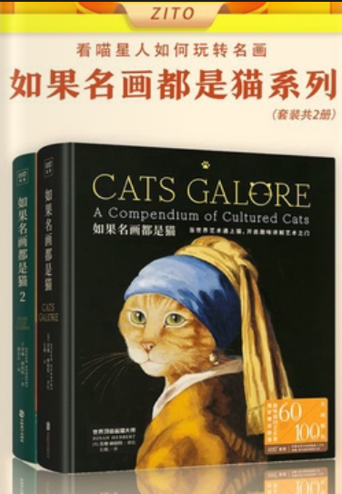
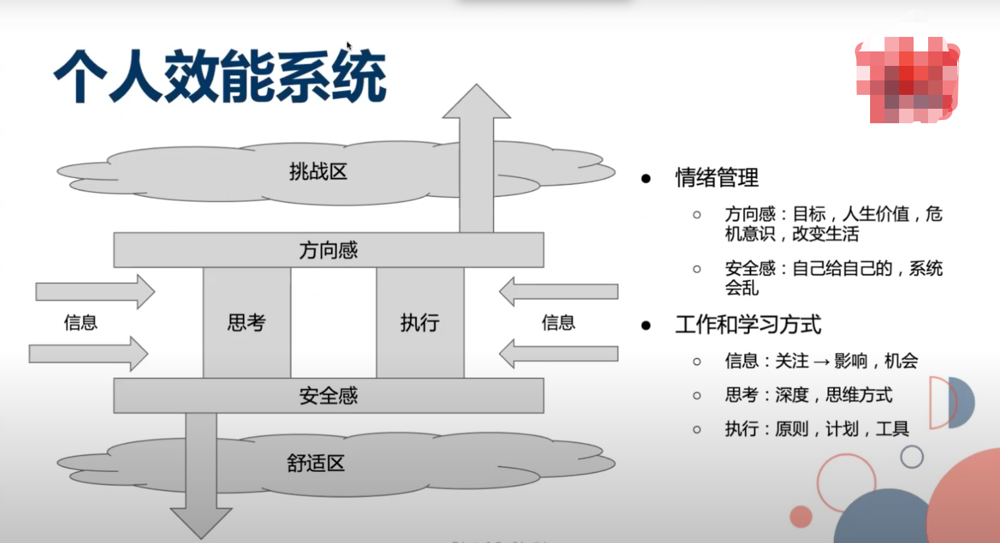

#### 1.《如果名画都是猫》 

逛书店的时候发现的这本图册，蛮有意思的，把世界名画里面的人像都改成了猫的样子

看到这就有了灵感，如果让AI来画会怎么样？之前知道AI画图的时候，并没有动手，是因为没有想画的图，即便有，也做不成系列。刚好这本书就提供了一个可以做成系列的灵感，例如如果名画都是狗？

另外现在深圳的书店可真有特色

#### 2. 领导的个人效能分享

领导关于「效能」的分享，其实还有组织效能和其他相关内容，不过个人而言，有用的还是这个个人效能系统：

系统需要不断的接收外界信息，并辅之以思考和执行，以此给自己增加安全感，并从中找到方向感，拓宽舒适区和挑战区的边界

#### 3. 推销的话术

和同事闲聊，同事说起了最近接到的贷款推销电话，发现了一些差异

- 国内的银行，例如招商银行等等，上来就说这里有一笔利率多少的贷款，明明回答说不需要了，还在那里使劲儿说自己的产品，多么便宜可以了解一下
- 而汇丰的推销电话，上来就问，最近有没有碰到困难，需不需要帮忙？说没有就不打扰了

目的都是一样的， 但是给用户的体验确实高下立见了

#### 4. 《第五共和国》

终于把《第五共和国》看完，感觉看了都有一个月了，因为《首尔之春》《出租车司机》种草了这部韩国历史剧，前面夺权的时候确实看的过瘾，但是后面稳定下来，开始党派斗争的时候，就感觉没有太大的意思了，而后面全斗焕和卢泰愚，都被清算了

一个政权在没落之后会被清算，大多源于在位期间作恶，为了自己的利益而去打击竞争对手。当大势已去，一旦留下把柄，就会被竞争对手死死咬住，后患无穷。感觉从古至今，似乎都是如此

舆论真的是最佳的武器，再怎么独裁，也会形势所迫

#### 5. [他们以为我疯了 其实我成为了白日梦想家-哔哩哔哩](https://b23.tv/qo7N5Hu)

一段短片，镜头语言非常有特色，就像看电影一样，许久没看到这么有质感的短片了

#### 6. 灵感-小红书标题生成器

即刻上的一个帖子：[据说是小红书爆款标题的关键词，为什么我看了想吐？](https://okjk.co/e8hoYg)，评论区提供了一个想法，将数据喂给AI，然后就可以制作一个标题生成器了

没有实践，不过感觉蛮可以，有时候起个标题还挺难的，不如试着交给AI，现在连数据集都有了，还是别人找好的。

#### 7. 一个超时问题的思考

系统有个告警，根据错误码去查，发现有大量超时，下意识的反应是这个下游有问题，可是下游是个基础服务，它要是出问题，估计业务全都有问题才对，然而只有我的服务有问题，没有头绪。同事提醒了一下，是链路其中一个接口慢了，代码执行到这里的时候才超时。这才反应过来

我本应该能想到的，但都没第一时间想到这只是问题所引发的现象，而不是问题本身，下次遇到问题还是得先想想：这只是现象，还是问题
