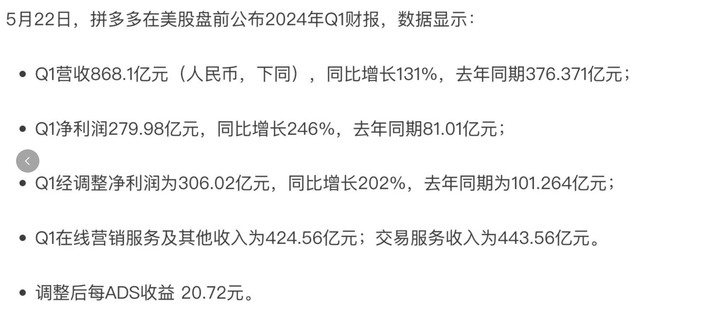

### 1.《长安的荔枝》与马伯庸的写作公式

---

把《长安的荔枝》看完，文笔和情节都很喜欢，忍不住熬了两个晚上没有早睡把这本书后半部分都看完了，过瘾

“一骑红尘妃子笑”的基层视角，上头一道命令就让底层焦头烂额，写尽了小人物的无奈与心酸。本以为生存无望，但在实际考察中试出了可能性并奋力一搏，务实但不懂为官之道，被人百般暗算刁难。顿悟之后学会用好处均沾来借权势之力，可最后落地过程中危机频发，违背了对朋友的承诺，夹在中间两头不是人。在幕后大佬的助力下，千辛万苦完成任务，可这劳民伤财的“不可能”的任务本身，不过是幕后大佬的权力炫耀...

基层好难。附两篇写的还不错的豆瓣影评
- [长安的荔枝：一部拿起来就放不下的小说（长安的荔枝）书评 (douban.com)](https://book.douban.com/review/14953079/)
- [荔枝看见了唐朝盛世下的蚁穴（长安的荔枝）书评 (douban.com)](https://book.douban.com/review/14713358/)

影评中，提到了一个「中间开场的叙事弧线」，再加上小红书推的一篇文章[【从马伯庸小说里提炼的“黄金描写公式” - 白夜漫游 | 小红书 - 你的生活指南】](http://xhslink.com/S9jhjK)，提到的「运镜+感官+心理+修辞+细节」5要素选取2-3个进行组合。顿时觉得，我好像也能试着写上一个小短篇

### 2. 《把资本主义倒过来》

---

PDD出了财报，净利增长200%，也太惊人了，在增速远大于亚马逊的情况下，同事都在用拼多多的2千亿和亚马逊的万亿市值做比对了

自然，又有一大堆自媒体开始分析pdd，看到的这篇 [电商的精神内耗，治不好](https://mp.weixin.qq.com/s/-khAkdVMJr06C7HahOgA7g) 写的还不错

看完的一些想法：

- 对工厂运作不了解，但似乎停产线是挺亏本的事情。所以就会有工厂愿意为了不停生产线，而去卷价格吗？感觉上是这样子

- 自己及周边人的生活水平只是冰山一角，不代表真实世界的样子。这个道理一直懂，但是到了电商场景：低质量残次品也会有人买单？这是之前所未能理解的，甚至他们还觉得OK

- 黄峥早年的公众号文章《把资本主义倒过来》的设计，现在看看确实牛逼，

  - 不仅理解了保险的本质

    - > “保险是资本主义的极致创造，一边是抗风险能力弱的穷人掏钱向抗风险能力强的富人购买抗风险资源，另一边是富人把钱投到能够产生复利的资产果园里，整个结构确保了财富从穷人到富人的持续转移”

  - 还开了脑洞

    - > “设计出某种反向保险产品，让穷人去给富人出售抗风险能力并占到便宜”，

  - 并且想到了实际场景：

    - > “1000个人联名写信给服装厂，愿意出10%的定金集体采购1000件羽绒服，而服装厂也会很愿意给出30%的折扣，因为这里面最稀缺的就是消费的确定性，只要订单顺利排产，成本就能从上游那里再挤一挤”
      >
      > 如果这1000人信用记录比较好，那么他们哪怕不付10%的定金，是不是也有服装厂接单？底层逻辑相当于是服装厂通过让利去向消费者购买一个「等我发货了你确定要付钱」的保险

  - 我好奇的点在于，怎么才能想到这样的角度？道理都懂，但落到实际场景就理解无能，还是对真实商业世界了解太少，连工厂怎么运作的都不知道🤷，也没有开过店，没有实际体感，对商业世界的理解只停留在媒体报道

- 还有一点理解无能，就是账号资产，虽然不努力就会被算法抛弃，但如果能累积品牌信誉，还是蛮重要的吧。除了那些评价信誉根本不重要，能用就行的商品，但经营不善的时候，确实重开是个成本更低的选择

  - > 在强分配、弱运营的流量系统里，连店/号都不重要了，卖家相当于平台SKU的发货机器，用户没必要知道你是谁

- 现在看下来，拼多多就是一个商品分配系统，一群人要一批货，然后拼多多就匹配最便宜的货源，从哪家店来的根本不重要，质量不行直接给你仅退款。这玩法确实是行业创新了

另外在看([封面报道之二｜大厂在收缩_财新周刊频道_财新网 (caixin.com)](https://weekly.caixin.com/2024-04-13/102185663.html?p0#page2)的时候，也提到了拼多多

> 拼多多抓住了中国零售业最近一轮去库存的商机。大疫三年，市场消费信心疲弱，消费降级趋势显著，部分品类商品销售不畅、库存积压，拼多多抓住机会成为商家清货渠道。

于是得知了商品价格低的两个可能逻辑：

- 厂家愿意低价出货保持生产线正常运转
- 积压的货物愿意低价清仓，节省仓储成本

### 3. 标题的预设角度与立场

---

最近胖猫事件在网上议论纷纷，也不乏有自媒体谈论自己的观点。然后官方通告一出，事件似乎迎来了反转，但看客自然各有各的观点，有意思的是，有人顶着高仿号去出某大V的[合订本](https://space.bilibili.com/3546582158936774/channel/collectiondetail?sid=3058813) ,不由得陷入沉思，现在网络上的风气都这么对立吗？

这种现象级讨论的背后，必然反应了某种社会心理状态，非专业的我不懂，也不好评价这次事件。但是我觉得此时的我，太容易受自媒体的标题影响了，在点开文章/视频之前，脑子里就已经植入了预设的角度与立场，反转？没有反转？全程带着先入为主的角度，然后一次次被“说服”，接着失去了依据客观事实形成自己观点的机会，脑子里都是别人预设好的观点

不可取，还是接受的阅读训练太少，未曾去刻意练习提炼客观事实的能力，自然容易被观点所迷惑

### 4. 设定站立办公的时间

---

每天久坐，适当站起来办公很有必要

一般都会建议说，每半个小时起来活动一下，但是这种做法很难坚持，个人觉得是因为不好计时。精确或者模糊计时半个小时或者一个小时， 只要开始的时间不是准点，对于下一个周期计算都会相对复杂。当然啦，也可以凭感觉，坐着不舒服了就站着，站着不舒服了就继续坐着，但这样的问题在于，时间长短不好控制，最后反而大多数时间都是坐着

所以想到了一个方法，直接设定站立式办公的时间，例如办公时间，10:00～12:30， 14:00 ～ 19:00

那我的站立时间就是

- 11:00 ～ 11:30
- 15:00 ～ 15:30
- 16:30 ～ 17:00
- 18:00 ～ 18:30

这四个时间范围，只要看到当前时间处于这个时间范围就站着，不在的时候就坐着，偶尔对不上也没有关系，时间长了，时间节律就会固定下来了

### 5. 我国的血液产业

---

近期英国发布了一个调查报告，美国的进口血液来自囚犯和吸毒者，使得3万人通过血液制品感染艾滋等病毒，血液对于健康至关重要，估计患者们都想不到会因此得病。感觉美国的生化产业黑幕好多，有3M公司的永久化学物质PFAS，有《成瘾剂量》里的药物成瘾，如今又有污染血，被资本主义裹挟的社会，受伤的永远是无权无势的老百姓

刚好有看到B站这个科普，[【硬核】卖血，特权，冷知识，爆肝2万字揭秘血液产业](https://b23.tv/R71HozD)，解答了我对献血的疑问

- 我无偿献的血，会被拿去卖，从而获取利益吗？
- 之前朋友家属车祸，朋友圈希望大家去献血，献血救人不是要匹配血型吗？

根据视频内容个人的一些理解（不一定能还原UP主本意）：

- 献血的收益都是上交国库的，然后采集血，制备，保存处理等的费用，全部都由国家预算支出，收入与支出都由国家把控，甚至还得倒贴。非法获取利益的可能性比较小，贪腐也只能从其他地方入手
- 当地血荒，非危重症的情况下，需要先补充血液，保证血液充足，医院才可以用血

除了这些，视频比较全面的讲述了我国血液产业的现状，才知道原来不止有国家把控的无偿献血站，还有商业机构也在有偿采集、制备售卖血液制品

### 6. [拼字幕工具]((https://www.pinzimu.com/))

---

即刻上的一个帖子[一键免费生成名人语录字幕拼图工具「拼字幕」 详细介绍：ht - 即刻App (okjike.com)](https://m.okjike.com/originalPosts/664d4e04fac7eab113e5b546?s=eyJ1IjoiNTg4NjNiODNlMjVmMzgwMDE1NmFiYTdiIiwiZCI6MX0%3D)，可惜原贴只贴了一个星球引流贴，好在评论区有大牛直接贴了[工具链接](https://www.pinzimu.com/)，省流

### 7. [BBC紀錄片：下藥、性侵和羞辱——揭露韓流明星聊天室裡的秘密](https://www.youtube.com/watch?app=desktop&si=WrNbV61iWTIY8Xtm&v=_yMNC0KlxPw&feature=youtu.be)

---

BBC最近放出来的纪录片，主要讲李胜利事件，具荷拉和记者也真的太勇敢了，敢曝光这些事情，和这么大的势力对抗。平时不追星，看完之后觉得韩国的司法系统都被资本裹挟了，充当保护伞的警察高层最后居然什么事都没有，不得不阴谋论的怀疑：李胜利也给某些青瓦台高层提供过服务，就跟之前的萝莉岛一样，政商互相打掩护。

还是中国好，吴亦凡都要牢底坐穿了。而且最近一部韩剧《The 8 Show》又火了，看了解说版[花4320万买你一整天，比鱿鱼更精彩的人性游戏！爆肝1万字解析韩剧《金钱游戏》 ](https://b23.tv/tz7Q7eu)，一种穷人只配给富人当“玩具”的感觉，而且出现这样的题材，感觉某种程度上也反应了民众在贫富差距过大时的一些心理状态，万恶的资本主义

### 8. 提升钢琴视奏能力的技巧

---

学钢琴的时候，好奇为什么老师视奏能力这么强，拿到陌生的谱子就能弹，复杂的虽然会卡顿，还是反应也蛮快的。而我连认谱都困难，练习时长是一个原因，但也好奇区别在哪里

正常我在视奏的时候，看一个弹一个，这是很合理的做法，咨询并观察了一下，老师在手弹的时候眼睛就已经在看后面好几个了，眼睛看的和手弹的不是实时一致的，顿时觉得老师分脑能力很强，可以一个脑子在控制眼睛看，一个脑子在控制手动，而且手在动的时候还得保持音符的节奏。

不禁在想，我是否也可以？只看手眼协调的话，应该手放好位置准备弹的时候，眼睛就要看下一个音了。然而现在还是手确保弹下去了，眼睛才往后移，为什么会这样？作为初学者，感觉我多了一个确认的动作，我在确认我弹下去的和谱子上的音是一致的。如果不确认，那就可以在手放好位置之后，眼睛就继续往后了。而要做到无需确认，就得识谱+手指灵活不弹错了，也是需要长时间的刻意练习

