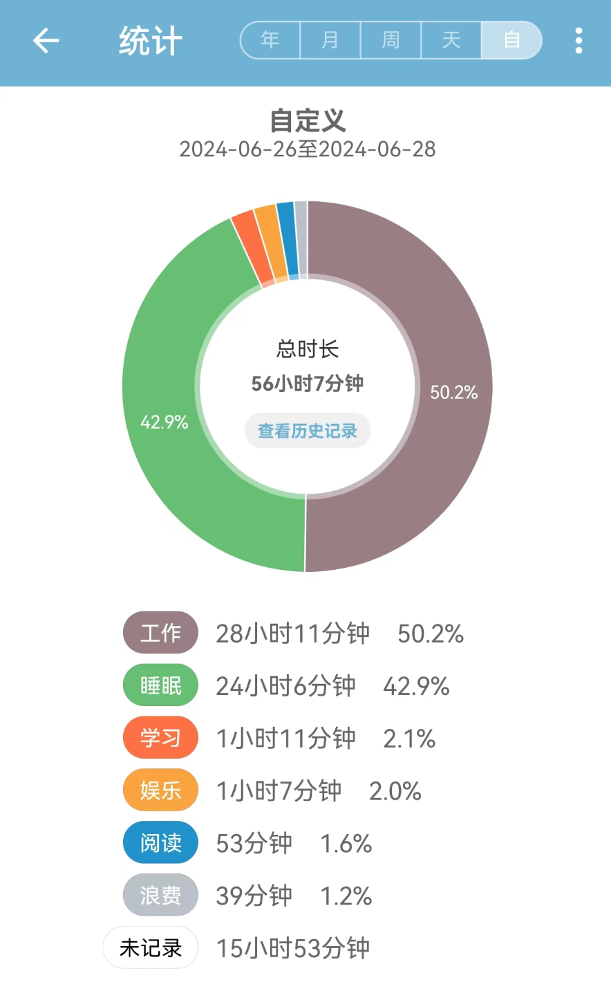
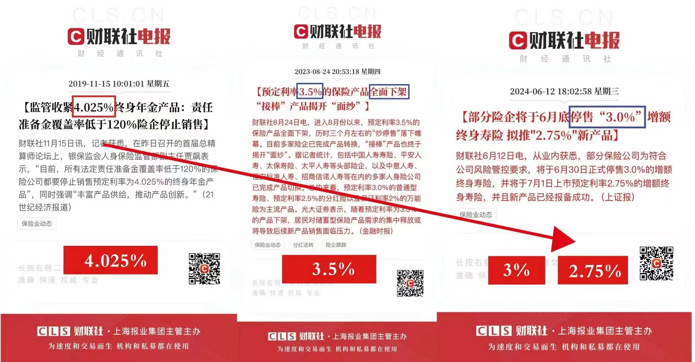
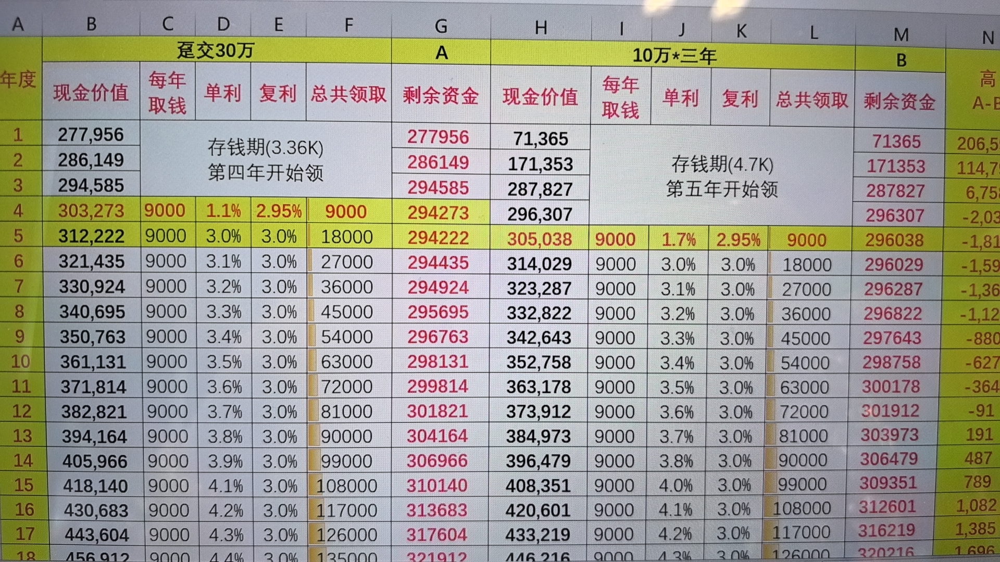

这两周都很忙，工作之外的内容不多，合并到这周一起写

### 1. 关于《时间贫困》

---

前段时间小红书上一直有帖子推荐一个播客: [EP38《时间贫困》：一个人的时间花在哪里，是看得见的 - 纵横四海 ](https://www.xiaoyuzhoufm.com/episode/657d53aa20d779b49d86d299),并且附上了自己的一些时间记录。当时就觉得有点新颖，记录时间？比记账还要繁琐，真的有人会去这么做吗？看了播客介绍，决定有点意思，还是决定先看完这本书

书看完了，播客听了一部分，这周也慢慢开始体验，用APP记录自己的时间去哪儿了

看到自己最近三天的时间分布，感受还是蛮奇特的，肉眼可见的上班（加上通勤）的时间，居然超过睡觉时间了，最近工作上事情挺多，加了几天的班，感觉除了上班就是睡觉。真的**一个人的时间花在哪里，是看得见的**，可支配时间太少，一点都不开心

可支配时间，是指去掉那些必做的事情，例如工作吃饭洗澡等等，自己想做什么就可以做什么的时间。《时间贫困》的作者做了统计，一天之中可支配时间的合理时间长度在2-5小时之间，低于2小时就会觉得时间不够用，超过5个小时就会觉得无所事事。从我自身的角度，最近加班让我觉得没时间运动，没时间做其他喜欢做的事情，幸福感降低极其明显

加班中，显而易见的发现自己的情绪变得毛躁，因为别人的原因导致自己要加班的情况下，都没有以前宽容了，怨气需要有个地方发泄。而且在排期的压力下，体会到了软件工程里面的确存在，质量-人力-排期的不可能三角，不可能在人力紧缺的情况，还能高质量高效率地完成任务，而且一般排期是提前定好的，于是大家都很默契的选择牺牲质量。 现在的质量差，这就导致后面的软件开发需要更多的人力，更久的排期来完成任务，陷入了一种恶性循环，而且同事之间还充满了怨气

这就是时间贫困感受下的负面情绪，每天都很抗拒上班，不自觉陷入了预防聚焦，即关注点都在那些不开心的事情上，极度想要逃避，而不是积极的去做一些开心的事情让自己开心起来。当然上层不合理的排期是主要原因，但不能因为这样就影响了自己的心情，既然时间贫困是一种主观感觉，那有没有办法在客观时间恒定的情况下，让自己感觉到时间充裕呢？

书里提到了两个比较反直觉的例子，运动和行善。 个人觉得非常有意思，有种反其道而行之的意味。作者做过试验发现，当人们忙起来的时候，就不会去运动，而且遇到需要帮助的人时，也会非常吝啬的伸出援手，“我完全没有时间做这些事情”。那么反过来想，我已经在做这些本来没有时间做的事情，不就说明我现在的时间还算充裕吗？当时就觉得这种方法非常的妙！

书里和播客中还提到了很多，关于如何投资时间让自己感到更快乐的内容，还没来得及做笔记，当前我觉得我该做的，还是先养成记录时间的习惯。不过应该不难，记账都快10年了，才意识到，这本书能突然抓住我的眼球，还是因为市面上太多关于钱的内容了，金融、理财等等，极少数内容会提醒自己去关注时间去哪儿了，虽然很多清单效率APP，但重点都是任务Todo，而不是时间。写到这，这就买个永久会员，支持下这款时间记录APP，几顿日常吃饭的钱，属于花小钱给自己解决大问题了

### 2. 有趣的制造

---

[因为懒得下床关灯，我做了一根魔杖](https://b23.tv/B4PPL9Z) ，佩服UP主有这么有趣的创意，以及超强的动手能力和执行力

然后这几天朋友还给我说了一个手机的物理锁盒的故事，keepin box，大概是创业者发现很多人抵挡不住手机的诱惑，但是大多数软件APP都在尽可能的吸引用户停留，市面上没有一款产品可以帮助别人完全不玩手机。于是跟家人朋友说了这个想法，拿了一笔钱去工厂生产，然后卖火了的故事

有创意的想法->生产商品->解决少数人的需求，也是一个路子

### 3. IRR评估保险利率里的猫腻

---

近期保险圈出了个消息，大概就是3%利率的增额终生寿要停售了，后面都是2点几的利率，保险业务员都在推销。因为股市基金行情不太好，银行定存利率也很低，看到3%利率终身复利，还是忍不住去了解了一下对应的产品。

如果只听销售员的一面之词，感觉就要被忽悠了，上小红书上搜，普遍都提到了一个计算利率的方法——IRR，简单来说就是考虑上时间的因素，几笔现金的流入流出，最后的收益率有多少。直接用Excel的函数就可以算出来

因为是纯理财的目的，所以基本只看现金价值，用IRR算了下，推销的这款产品，发现居然要接近20年，才能达到所谓的3%的收益，那会都要50岁了，完全不敢想象这笔钱能不能放到20年。另外这个表格里说的复利3%，感觉也是故意用来迷惑的，为了凸显3%专门写的利息9k，但很明显可以看出来，真按每年9K提取，剩余资金都已经低于本金了，而且如果从产生利息开始，连续提取9k，得到10年，本金才能回来。。。短期哪里来的3%复利，不准备长期放20年的话，都觉得反而会亏。

而一笔钱锁死20年，现在完全不敢想象。

